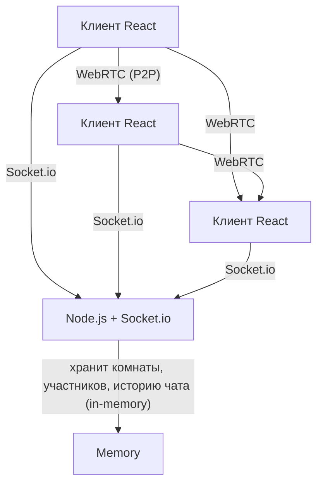

# Technical Design Document — Video Chat Room

| | |
|---|---|
| **Документ** | TDD |
| **Версия** | 1.0 |
| **Основан на** | PRD `prd-video-chat-room.md` |
| **Feature** | `video-chat-room` |
| **Стек** | JavaScript (ES6+), Node.js, React, Socket.io, WebRTC (mesh) |

---

## 1. Overview / Контекст

**Цель** – реализовать веб-приложение для группового видео-чата до 4 участников с текстовым чатом, без регистрации, с мгновенным подключением по ссылке.

**Ключевые ограничения**:
- Топология медиа – **WebRTC mesh** (P2P), каждый клиент соединяется с каждым.
- Сигналинг и чат – **Socket.io** (сервер Node.js).
- Хранение – только в памяти сервера (без БД).
- Клиент – React (без SSR), работает в современных браузерах.
- HTTPS обязателен (или localhost).

---

## 2. Current Architecture & Codebase Summary

Проект разрабатывается **с нуля**. Исходного кода нет. Поэтому архитектура будет построена полностью по данному TDD.

---

## 3. Proposed Architecture / High-Level Design



- **Клиент**: React SPA, использует `getUserMedia`, `RTCPeerConnection`, Socket.io-client.
- **Сервер**: Node.js с Express (раздача статики) и Socket.io (сигналинг, чат, управление комнатами).
- **Данные**: объект `rooms` в памяти сервера: ключ – ID комнаты, значение – { participants, messages, createdAt }.

---

## 4. Components & Interfaces

### 4.1. Backend (Node.js + Socket.io)

| Компонент | Ответственность | API / События |
|-----------|----------------|---------------|
| **Socket.io Server** | Обработка подключений, управление комнатами, маршрутизация сигнальных сообщений и чата. | `connection`, `disconnect`, `join-room`, `leave-room`, `signal` (WebRTC SDP/ICE), `chat-message`, `get-room-state` |
| **Room Manager** | Хранит состояние комнат, проверяет лимит участников, создаёт/удаляет комнаты. | Внутренние методы: `createRoom(roomId)`, `addParticipant(roomId, socketId, name)`, `removeParticipant(roomId, socketId)`, `getRoom(roomId)` |
| **Chat History** | Хранит сообщения в памяти и рассылает их новым участникам при входе. | Массив `messages` в объекте комнаты. |

### 4.2. Frontend (React)

| Компонент | Ответственность |
|-----------|----------------|
| **App** | Роутинг (React Router) – стартовый экран и комната. |
| **StartScreen** | Поле ввода имени, валидация, кнопка «Создать комнату». Генерирует ID комнаты (или берёт из URL). |
| **Room** | Основной экран: видеосетка, панель управления, чат, список участников. |
| **VideoGrid** | Отображает плитки участников (self-view + remote). Управляет добавлением/удалением потоков. |
| **VideoTile** | Отображает видео/заглушку, имя, иконки статуса микрофона. |
| **ChatPanel** | Список сообщений, поле ввода, авто-прокрутка. |
| **Controls** | Кнопки включения/выключения камеры, микрофона, выхода, копирования ссылки. |
| **WebRTCManager** (хук/класс) | Управление `RTCPeerConnection` для каждого участника: создание офферов/ответов, добавление треков, обработка ICE. |
| **SocketManager** (хук) | Подключение к серверу, отправка/подписка на события. |

---

## 5. Data Model & DB Changes

**Хранилище – in-memory на сервере.** Никакой БД.

Структура объекта `rooms`:

```javascript
const rooms = {
  [roomId]: {
    id: string,
    participants: [
      {
        socketId: string,
        name: string,
        joinedAt: timestamp,
        // медиа-состояния хранятся на клиенте, но сервер может хранить их (опционально)
      }
    ],
    messages: [
      {
        id: string,
        senderName: string,
        text: string,
        timestamp: number, // Unix ms
      }
    ],
    createdAt: timestamp,
  }
}
```

**Миграции** – не требуются.

---

## 6. API / Contracts

Все взаимодействия – через **Socket.io** (веб-сокеты).

### События от клиента к серверу

| Событие | Данные | Описание |
|---------|--------|----------|
| `join-room` | `{ roomId, name }` | Запрос на вход. Сервер проверяет лимит (≤4), добавляет участника, отправляет текущее состояние комнаты и историю чата. |
| `leave-room` | `{ roomId }` | Выход из комнаты. Сервер удаляет участника, уведомляет остальных. |
| `signal` | `{ roomId, targetSocketId, signalData }` | Пересылка SDP-оффера/ответа или ICE-кандидата целевому участнику. |
| `chat-message` | `{ roomId, text }` | Новое текстовое сообщение. Сервер добавляет его в историю и широковещает всем в комнате. |

### События от сервера к клиенту

| Событие | Данные | Описание |
|---------|--------|----------|
| `room-state` | `{ participants, messages }` | Отправляется новому участнику при успешном входе (вся история и список). |
| `participant-joined` | `{ participant }` | Рассылается всем, когда кто-то входит. |
| `participant-left` | `{ socketId, name }` | Рассылается всем, когда кто-то выходит. |
| `signal` | `{ fromSocketId, signalData }` | Пересылка сигнального сообщения от другого участника. |
| `chat-message` | `{ message }` | Новое сообщение в чате (широковещательно). |
| `error` | `{ message }` | Ошибка (например, «Комната заполнена»). |
| `room-full` | `{ message }` | Специальное событие при попытке входа в полную комнату. |

---

## 7. Data & Control Flows

### 7.1. Создание комнаты и вход

1. Клиент генерирует `roomId` (например, `uuidv4()`) или берёт из URL.
2. Клиент подключается к Socket.io и отправляет `join-room` с именем.
3. Сервер проверяет: если комната не существует – создаёт. Если существует – проверяет число участников <4.
4. При успехе сервер добавляет участника, сохраняет его socketId.
5. Сервер отвечает `room-state` (история чата и список участников).
6. Сервер уведомляет остальных через `participant-joined`.
7. Клиент, получив `room-state`, инициализирует WebRTC: для каждого существующего участника создаёт `RTCPeerConnection` и отправляет offer (или ждёт offer от них – зависит от реализации, проще: каждый новый участник отправляет offer всем предыдущим, но можно использовать «клиент-серверный сигналинг» с обменом офферами/ответами. Рекомендуется: при входе новый участник генерирует offer для каждого уже присутствующего и отправляет через `signal`; те отвечают answer).

### 7.2. Обмен медиа (WebRTC mesh)

- Каждый участник имеет отдельный `RTCPeerConnection` с каждым другим.
- При получении `signal` (offer/answer/ICE) клиент обрабатывает его через соответствующий `RTCPeerConnection`.
- После установки соединения медиа-потоки передаются напрямую P2P.

### 7.3. Чат

- Клиент отправляет `chat-message` с текстом.
- Сервер добавляет сообщение в массив `messages` комнаты (с временем и именем отправителя).
- Сервер широковещает `chat-message` всем участникам комнаты.
- Новый участник при входе получает всю историю через `room-state`.

### 7.4. Выход и удаление комнаты

- Клиент отправляет `leave-room` или закрывает вкладку (событие `disconnect`).
- Сервер удаляет участника из комнаты.
- Если участников не осталось – удаляет комнату (и её историю).
- Сервер уведомляет остальных через `participant-left`.

---

## 8. Error Handling & Edge Cases

| Ситуация | Обработка |
|----------|-----------|
| **Отказ в доступе к камере/микрофону** | Браузер выдаёт ошибку `NotAllowedError`; показываем сообщение, но пользователь остаётся в комнате с выключенными устройствами. |
| **Комната заполнена (5-й участник)** | Сервер отклоняет `join-room` и отправляет событие `room-full` с сообщением. Клиент показывает сообщение и кнопку «Повторить». |
| **Одновременный вход двух участников в последний слот** | Сервер атомарно проверяет лимит (используя блокировку или проверку перед добавлением) – гарантирует, что только один попадёт. Другой получит `room-full`. |
| **Обрыв соединения участника** | Socket.io `disconnect` – удаляем участника, остальные получают `participant-left` без дополнительных формулировок. |
| **Закрытие вкладки / перезагрузка** | `disconnect` – участник выходит. При перезагрузке – новый вход, требует ввода имени. |
| **Ошибка `getUserMedia` (устройство занято, отсутствует)** | Показываем сообщение, но вход разрешён. |
| **Недоступность STUN-сервера** | WebRTC может не установить соединение; это допустимо, пары могут не соединиться. Приложение не должно падать. |
| **Не поддерживается WebRTC** | Проверяем `!!window.RTCPeerConnection`; если нет – показываем сообщение. |
| **Политика autoplay** | Обеспечиваем жест пользователя – кнопка «Войти» запускает аудио-контекст. |
| **Пустое имя или спецсимволы** | Валидация на клиенте: имя не пустое, длина ≤30, допускаются только буквы, цифры, пробелы, дефис, подчёркивание (регулярка). |
| **XSS** | Экранируем имена и сообщения перед рендерингом (использовать `textContent` или библиотеку для санитайзинга). |

---

## 9. Performance & Scalability

- **Целевая задержка** ≤ 500 мс в локальной сети.
- **Максимум 4 участника** – mesh топология даёт 6 P2P соединений на комнату, что допустимо для клиентов.
- **Потолок битрейта** – не ограничиваем, браузер сам регулирует.
- **Сервер** – только сигналинг и чат; нагрузка мала (до десятков комнат одновременно).
- **Кеширование** – не требуется.
- **Масштабирование** – при необходимости можно запускать несколько экземпляров с Redis (но это out of scope).

---

## 10. Security & Compliance

- **HTTPS** обязателен для `getUserMedia`.
- **Экранирование** всех пользовательских вводимых данных (имена, сообщения) перед вставкой в DOM.
- **Отсутствие авторизации** – доступ по ссылке, это осознанное решение.
- **Никаких паролей, сессий, токенов**.
- **WebRTC** использует DTLS-SRTP для шифрования медиа.

---

## 11. Testing Strategy

| Уровень | Инструменты | Что покрываем |
|---------|-------------|---------------|
| **Unit** | Jest, React Testing Library | Компоненты React (рендеринг, события), утилиты валидации, логика WebRTCManager (mock-объекты). |
| **Integration** | Supertest (API), Socket.io-client mock | Серверные обработчики событий, лимит комнаты, история чата. |
| **E2E** | Playwright / Cypress | Полный сценарий: создание комнаты, вход двух участников, обмен видео (mock медиа), отправка сообщений, выход. |
| **Load** | Не требуется, т.к. лимит 4. |

**Цель покрытия** – >80% для критической логики.

---

## 12. Deployment & Migration Plan

- **Сборка клиента**: `npm run build` (React).
- **Запуск сервера**: `node server.js` (или через PM2).
- **Требования**: Node.js 18+, npm.
- **Feature-flags** – не требуются.
- **Откат** – переключение на предыдущую версию кода.
- **CI/CD** – не обязателен для тестового задания, но можно настроить GitHub Actions.

---

## 13. Risks & Mitigations

| Риск | Смягчение |
|------|-----------|
| WebRTC-соединения не устанавливаются из-за NAT | Используем публичные STUN-серверы (Google). TURN не используем – это допустимо по PRD. |
| Сложность отладки WebRTC | Используем `chrome://webrtc-internals` и логирование. |
| Политика autoplay блокирует аудио | Обеспечиваем жест пользователя (кнопка). |
| Одновременные гонки при входе | Используем атомарную проверку с блокировкой (например, `async` очередь). |

---

## 14. Open Questions / TBD

- Нет нерешённых вопросов – все детали покрыты PRD.

---

## 15. References

- PRD: `prd-video-chat-room.md`
- Правила: `prd-design.mdс`, `prd-tasks.mdс`
- Демо: `https://chat.forasoft.com`
